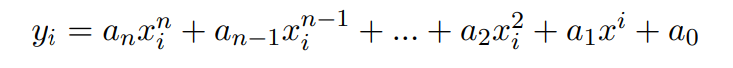
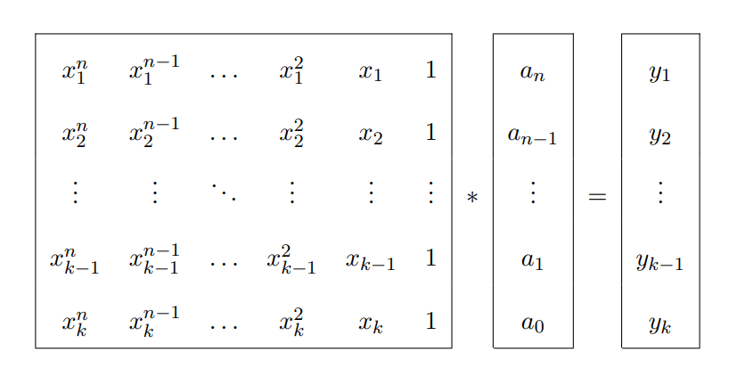

# QR-based Polynomial Regression
## Introduction

The goal of this project is to produce a C function that receives a set of points in 2D space and an integer `n` representing the degree 
of the polynomial we want to approximate the points with, and returns the n coefficients of said polynomial that minimize the sum of squares 
of the residuals.

This C function will communicate with Matlab through a Mex function. All the necessary operations will be performed using BLAS and LAPACK computational 
routines, instead of one of the driver routines that would solve this problem with just one call.

## Method used

Given a set of `k` points (xi, yi) and `n` the degree of the polynomial we want to use to approximate the points, the 
problem we want to solve is:

 
<!--yi = anxin + an-1xin-1 + ... + 
a2xi2 + a1xi + a0-->

As a system of linear equations `Ax=b`:

 

This system will normally be over or underdetermined, as the degree of the polynomial used does not have to be equal to the number of points 
in the set.

In order to solve it, we calculate the QR decomposition of A (A=QR), and then Rx = Qtb

